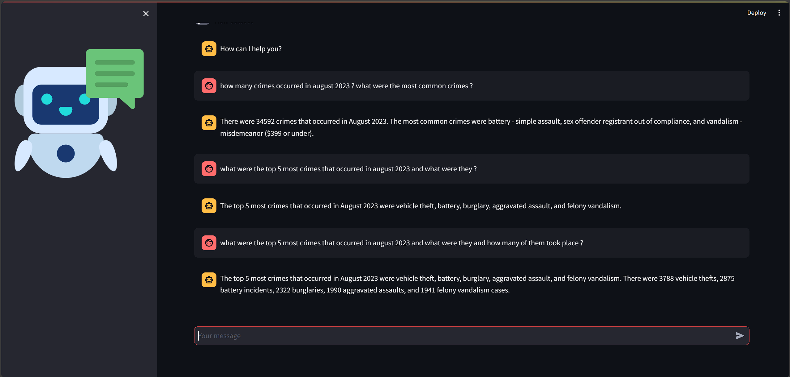

# Ask DB

Ask DB is an AI assistant that can understand your DB schema & content and answer questions in natural language.
Currently it uses ollama's LLM service using the concept of retrieval-augmented generation, meaning, it understand the data and schema from the db and uses appropriate SQL query to extract the information needed to answer your question.



With a simple schema, the model is able to join the appropriate table, to answer a question like below.

**what were the top 5 most crimes that occurred in august 2023 and what were they and how many of them took place ?**

```sql
SELECT "crime_code_description"."crime_description", COUNT(*) AS "num_crimes"
FROM "crime_data"
INNER JOIN "crime_code_description" ON "crime_data"."crime_code" = "crime_code_description"."crime_code"
WHERE "date_occured" BETWEEN '2023-08-01' AND '2023-08-31'
GROUP BY "crime_code_description"."crime_description"
ORDER BY "num_crimes" DESC
LIMIT 5;
```
SQLResult: [('VEHICLE - STOLEN', 3788), ('BATTERY - SIMPLE ASSAULT', 2875), ('BURGLARY', 2322), ('ASSAULT WITH DEADLY WEAPON, AGGRAVATED ASSAULT', 1990), ('VANDALISM - FELONY ($400 & OVER, ALL CHURCH VANDALISMS)', 1941)]

**Answer:** The top 5 most crimes that occurred in August 2023 were vehicle theft, battery, burglary, aggravated assault, and felony vandalism. There were 3788 vehicle thefts, 2875 battery incidents, 2322 burglaries, 1990 aggravated assaults, and 1941 felony vandalism cases.


## Run locally

Depending on the model, say if you want to use `llama2:7b`, the modify the `.env` file to the preferred model name, and simply run `make dk_start`
